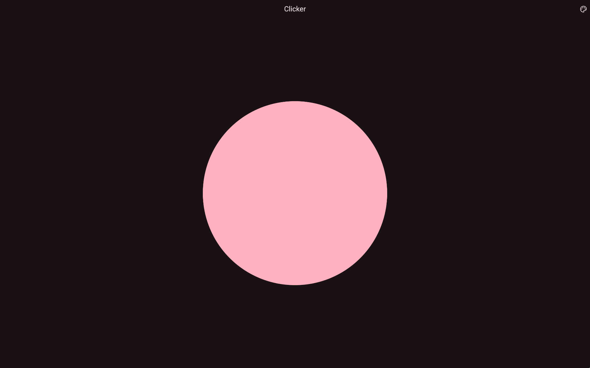

# 🐶 Dog Clicker

A latency-optimized clicker in Flutter.

> Arf~



## Getting Started

### Prerequisites

- Flutter SDK ([flutter.dev](https://flutter.dev/docs/get-started/install))
- (Optional) IDE such as VSCode or Android Studio

### Building and Running

1. Clone the repository:
   ```bash
   git clone https://github.com/yvvki/dog-clicker.git
   cd dog-clicker
   ```

2. Get the dependencies:
   ```bash
   flutter pub get
   ```

3. Run the app:
   ```bash
   flutter run
   ```

## License

This project is licensed under the MIT License, see the [LICENSE](LICENSE) file for details.
